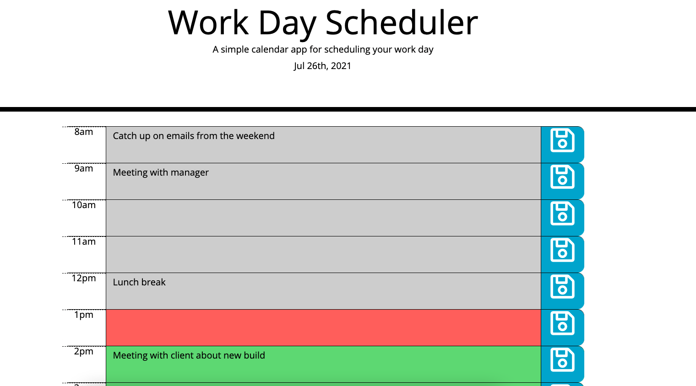

# Day_Planner

A simple calendar application that allows an employee keep track of their events throughout the work day during business hours. 

Today's date is displayed at the top. 

The user can enter in a description within the time slot. Once the user clicks on the save icon, it will save the information to the local storage so when the use opens up the application again, the information is still there. 

The calendar is also color coded. Current time slot is red. Past will appear in gray and anything in the future will appear in green. 